[](https://osugaming.sekai.team/)

This was mine and [DevvEn's](https://catboys.dev/) first ever CTF, and we were most definately feeling out of our depth for a while. Despite this and some unfortunate time constraints, we had lots of fun and hope you enjoy reading our attempts at solving the solutions. :3

***

## crypto/ `(4/8 solved)`

<details><summary>

### crypto/rot727 | `648 solves / 103 points`
</summary>

We are provided with the flag `aeg{at_imuf_nussqd_zgynqd_paqezf_yqmz_yadq_eqogdq}` that we are told has been rotated 727 times.

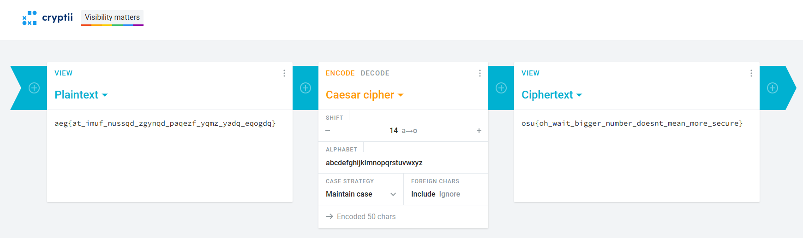

This is simply a caesar cipher so to solve this I went on the first website I could find, entered the given flag and shifted until I eventually recovered the original flag, `osu{oh_wait_bigger_number_doesnt_mean_more_secure}` after I shifted by 14 characters.
</details>

<details><summary>

### crypto/beyond-wood | `392 solves / 106 points`
</summary>

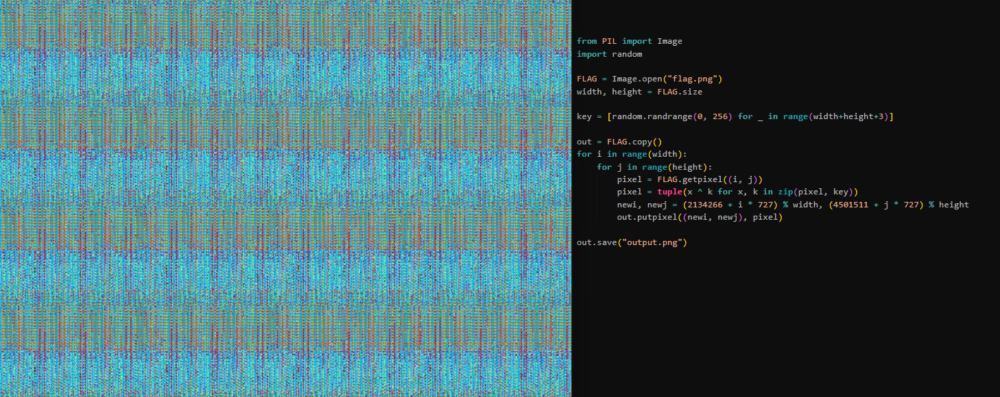

For this challenge, we are given a python program and a resulting image of the program when ran.  
What the program actually does is loop through every pixel of the image, getting the color at each point that then each value is raised to the power of the key by and then a new position for the pixel is calculated and the resulting color is written to that position.

I quickly realised that the secret key is irrelevant to solving this challenge since all we have to do is just restore the pixels to their original locations by slightly modifying the progrma and then we can read the flag!

```py
from PIL import Image

FLAG = Image.open("output.png")
width, height = FLAG.size

out = FLAG.copy()

for i in range(width):
    for j in range(height):
        newi, newj = (2134266 + i * 727) % width, (4501511 + j * 727) % height 
        out.putpixel((i,j), FLAG.getpixel((newi,newj)))

out.save("flag.png")
```

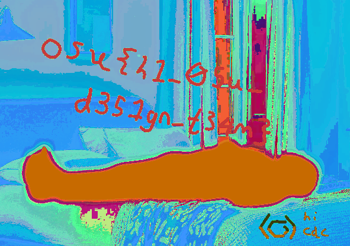

After running the program, we got an image where we could easily read the flag: `osu{h1_05u_d351gn_t34m}`
</details>

<details><summary>

### crypto/xnor-xnor-xnor | `348 solves / 107 points`
</summary>

In this challenge, we were told a link of a beatmap named XNOR XNOR XNOR and a python program with the output in a comment on the last line.

```py
import os
flag = open("flag.txt", "rb").read()

def xnor_gate(a, b):
    if a == 0 and b == 0:
        return 1
    elif a == 0 and b == 1:
        return 0
    elif a == 1 and b == 0:
        return 0
    else:
        return 1

def str_to_bits(s):
    bits = []
    for x in s:
        bits += [(x >> i) & 1 for i in range(8)][::-1]
    return bits

def bits_to_str(bits):
    return bytes([sum(x * 2 ** j for j, x in enumerate(bits[i:i+8][::-1])) for i in range(0, len(bits), 8)])

def xnor(pt_bits, key_bits):
    return [xnor_gate(pt_bit, key_bit) for pt_bit, key_bit in zip(pt_bits, key_bits)]

key = os.urandom(4) * (1 + len(flag) // 4)
key_bits = str_to_bits(key)
flag_bits = str_to_bits(flag)
enc_flag = xnor(xnor(xnor(flag_bits, key_bits), key_bits), key_bits)

print(bits_to_str(enc_flag).hex())
# 7e5fa0f2731fb9b9671fb1d62254b6e5645fe4ff2273b8f04e4ee6e5215ae6ed6c
```

I did not know how to go about solving this challenge so I resorted to asking for help from an AI, ChatGPT.

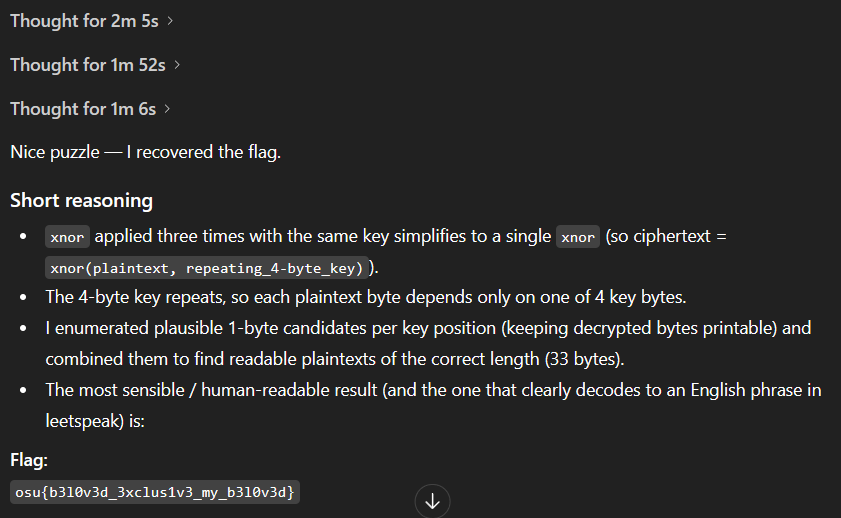

After it "thought" for a total of 5 minutes, it solved the challenge with the flag: `osu{b3l0v3d_3xclus1v3_my_b3l0v3d}`

</details>

<details><summary>

### crypto/pls-nominate | `224 solves / 111 points`
</summary>

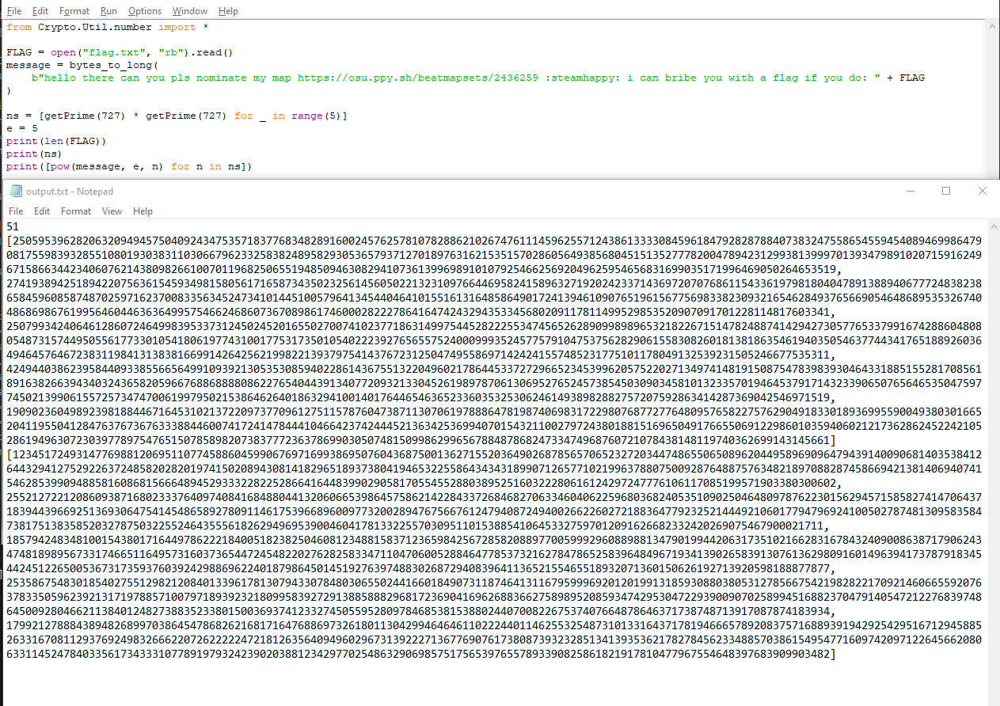
We are given a python file and an output text file (seen above). Analysing the python file we see that it takes the bytes of a message concatenaded with the flag we want, then exponentiates it by 5 before performing modulo operations on the value for 5 random generated 727-bit prime number.

The program gives us the prime numbers within the `output.txt`, and the product of pow() for each modulus. By combining the 5 output encrypted texts and computing the 5th root integer (by adding multiples of the primes until you get the 5th power), the result can be decoded to get the original message including the flag. 

```python
from Crypto.Util.number import *
from math import prod

ns = [250595396282063209494575040924347535718377683482891600245762578107828862102674761114596255712438613333084596184792828788407383247558654559454089469986479081755983932855108019303831103066796233258382489582930536579371270189763162153515702860564938568045151352777820047894231299381399970139347989102071591624967158663442340607621438098266100701196825065519485094630829410736139969891010792546625692049625954656831699035171996469050264653519, 274193894251894220756361545934981580561716587343502325614560502213231097664469582415896327192024233714369720707686115433619798180404789138894067772483823865845960858748702597162370083356345247341014451005796413454404641015516131648586490172413946109076519615677569833823093216546284937656690546486895353267404868698676199564604463636499575466246860736708986174600028222786416474243294353345680209117811499529853520907091701228114817603341, 250799342406461286072464998395337312450245201655027007410237718631499754452822255347456526289099898965321822671514782488741429427305776533799167428860480805487315744950556177330105418061977431001775317350105402223927656557524000999352457757910475375628290615583082601813818635461940350546377443417651889260364946457646723831198413138381669914264256219982213937975414376723125047495586971424241557485231775101178049132539231505246677535311, 424944038623958440933855665649910939213053530859402286143675513220496021786445337272966523453996205752202713497414819150875478398393046433188515528170856189163826639434032436582059667688688880862276540443913407720932133045261989787061306952765245738545030903458101323357019464537917143233906507656465350475977450213990615572573474700619979502153864626401863294100140176446546365233603532530624614938982882757207592863414287369042546971519,
      190902360498923981884467164531021372209737709612751157876047387113070619788864781987406983172298076877277648095765822757629049183301893699559004938030166520411955041284763767367633388446007417241478444104664237424445213634253699407015432110027972438018815169650491766550691229860103594060212173628624522421052861949630723039778975476515078589820738377723637869903050748150998629965678848786824733474968760721078438148119740362699143145661]
e = 5
cs = [123451724931477698812069511077458860459906769716993869507604368750013627155203649026878565706523272034474865506508962044958969096479439140090681403538412644329412752922637248582028201974150208943081418296518937380419465322558643434318990712657710219963788075009287648875763482189708828745866942138140694074154628539909488581608681566648945293332282252866416448399029058170554552880389525160322280616124297247776106117085199571903380300602, 25521272212086093871680233376409740841684880441320606653986457586214228433726846827063346040622596803682405351090250464809787622301562945715858274147064371839443966925136930647541454865892780911461753966896009773200289476756676124794087249400266226027218836477923252144492106017794796924100502787481309583584738175138358520327875032255246435556182629496953900460417813322557030951101538854106453327597012091626682332420269075467900021711, 185794248348100154380171644978622218400518238250460812348815837123659842567285820889770059992960889881347901994420631735102166283167843240900863871790624347481898956733174665116495731603736544724548220276282583347110470600528846477853732162784786525839648496719341390265839130761362980916014963941737879183454424512265005367317359376039242988696224018798645014519276397488302687294083964113652155465518932071360150626192713920598188877877, 253586754830185402755129821208401339617813079433078480306550244166018490731187464131167959996920120199131859308803805312785667542198282217092146066559207637833505962392131719788571007971893923218099583927291388588829681723690416962688366275898952085934742953047229390090702589945168823704791405472122768397486450092804662113840124827388352338015003693741233274505595280978468538153880244070082267537407664878646371738748713917087874183934,
      179921278884389482689970386454786826216817164768869732618011304299464646110222440114625532548731013316437178194666578920837571688939194292542951671294588526331670811293769249832666220726222224721812635640949602967313922271367769076173808739323285134139353621782784562334885703861549547716097420971226456620806331145247840335617343331077891979324239020388123429770254863290698575175653976557893390825861821917810477967554648397683909903482]

### N primes and cipher texts from output.txt ^

def crt_combine(ns, cs):
    N = prod(ns)
    total = 0
    for ni, ci in zip(ns, cs):
        mi = N // ni
        inv = pow(mi, -1, ni)
        total = (total + ci * mi * inv) % N
    return total, N

def integer_nth_root(x, n):
    if x == 0: return 0, True
    lo, hi = 0, 1 << ((x.bit_length() + n - 1) // n)
    while lo < hi:
        mid = (lo + hi) // 2
        if pow(mid, n) < x:
            lo = mid + 1
        else:
            hi = mid
    root = lo
    if pow(root, n) > x: root -= 1
    return root, pow(root, n) == x

combined, N = crt_combine(ns, cs)


for t in range(0, 10000):
    val = combined + t * N
    root, exact = integer_nth_root(val, e)
    if exact:
        break

plaintext = root.to_bytes(root.bit_length(), 'big')
print(plaintext.decode())
```
Running the program, we get the flag: `osu{pr3tty_pl3453_w1th_4_ch3rry_0n_t0p!?:pleading:}` 

God I hate math D:
</details>

<br>

***

## forensics/ `(1/1 solved)`

<details><summary>

### forensics/map-dealer | `206 solves / 113 points`
</summary>

We start off the challenge by being told that we need to recover a beatmap from the given archive, inside the archive we can find a .E01 file called `SanDisk.E01`. Doing research on what a E01 file is I found that it is a forensics disk image, and recovery was simple from there.

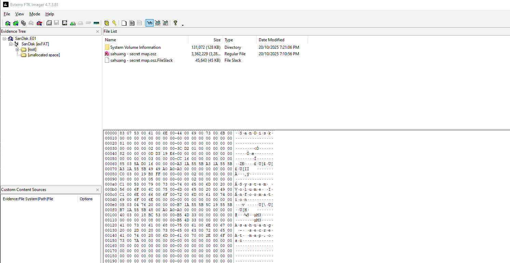

Loading the E01 file in `FTK Imager`, a forensics imaging software, and browsing through the files we can find the `.osz` beatmap file. However this does not give us the flag, so I dug deeper and started by loading the map into osu! to examine it. Upon loading, I found a flag within the difficulty name of the map, attempting submitting that yielded no results, however in the background of the beatmap we can see some text that resembles a flag.

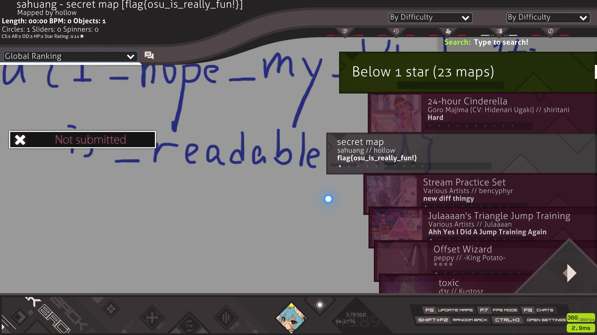

Opening a copy of the `.osz` file using WinRar we can browse the files of the beatmap, as the files are simply renamed archive files, we find our flag as suspected within the background `flag.png` image of the map: `osu{I_hope_my_h4ndwr1ting_is_readable_xd}`
</details>

<br>

***

## kaijuu/ `(1/5 solved)`

<details><summary>

### kaijuu/sanity-check | `275 solves / 109 points`
</summary>

This challenge tells us to see sahuang's latest beatmap on osu! as a beginning point. The beatmap I found was [Kaijuu ni Naritai](https://osu.ppy.sh/beatmapsets/2454199) and I quickly saw a flag in the mapper tags, `osu{append_38_goes_crazy}`.

This however did not work but when I downloaded the beatmap, imported it into osu! and inspected the .osu files of the beatmap, I finally found the flag `osu{APPEND_38_Goes_Crazy}` and solved the challenge.
</details>

<br>

***

## misc/ `(0/3 solved)`

<br>

***

## osint/ `(0/2 solved)`

<details><summary>

### osint/weebbolt | `83 solves / 136 points`
</summary>

This challenge requires us to locate 9/10 (minimum) places from the images given to receive the flag.

<br>

#### Loner - Found

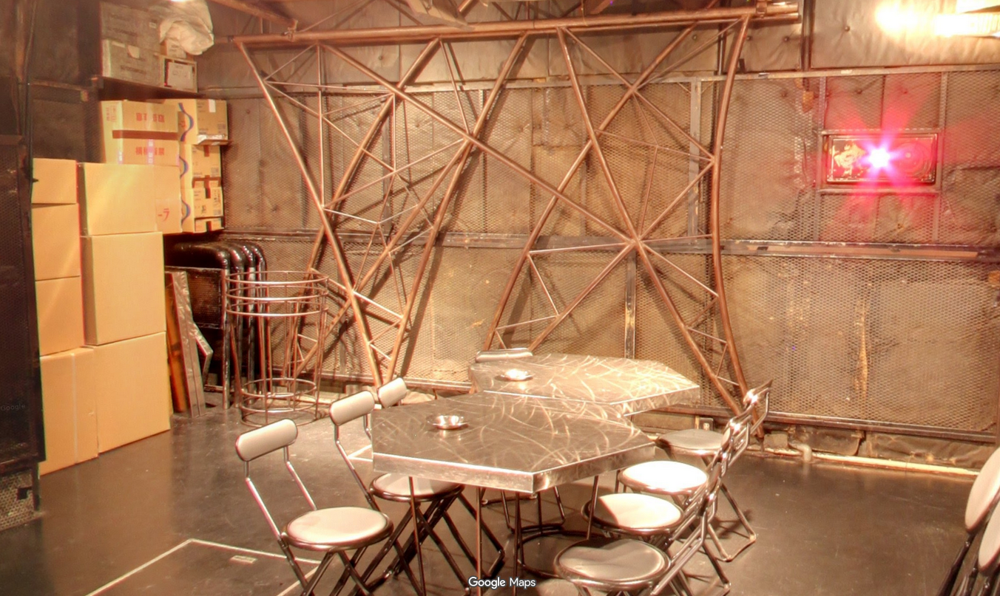

The first location we are tasked to locate is shown above, luckily, I sensed that the image felt familiar. Due to the nature of the challenge being 'weeb' related, I thought this to be the real life insipiration to the venue in Bocchi The Rock, sure enough after searching for the real life counterpart online, I found the real life location to to be the SHELTER venue in Shimokitazawa, Japan. 

<br>

#### Diary - Found

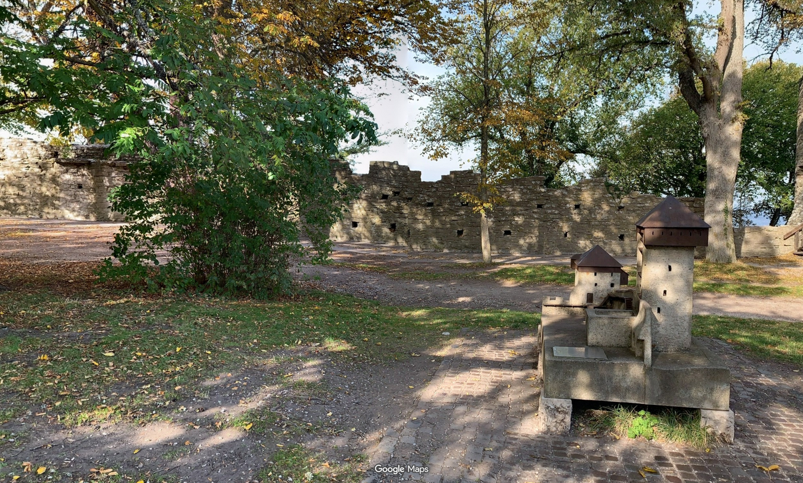

On first inspection, I could deduce that this location is likely not also within Japan, and is likely within Europe, due to the look of the walls in the back and the miniature castle figure reminding me of several similar locations I have visited in Europe. However this specific location did not ring any specific bells for me, and I first started by reverse image searching the miniature figure to the right.

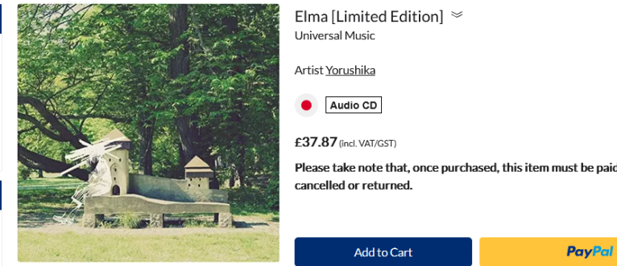

The results of the search lead me to this page of an album by Yorushika where the album cover visually matched the figure in the image we were given, albeit it seems to be a photo taken from the right hence the slight difference. Searching for information about the origins of the album cover lead me to a Reddit thread that discussed it, where I finally found the location, the Snäckgärds Gate in Visby, Sweden.

<br>

#### Ongaku - Found

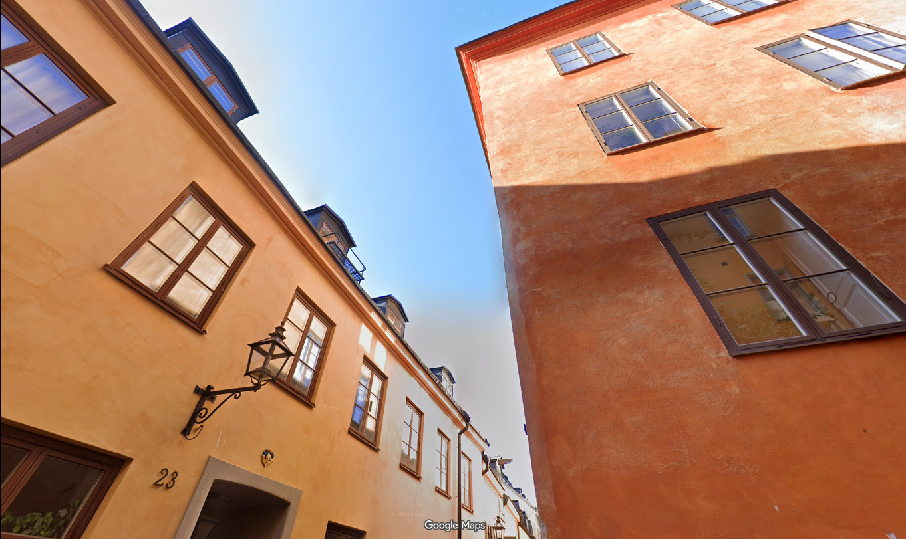

To be honest, I did not have much to go off here. We can see a 23 on the side of the building to the left, which could have been used to deducing exact location, however as I later found out that was not particularly necessary. While I presumed the location to be yet again somewhere in Europe, I decided to reverse search the image for any possible near matches. Luckily enough, one of the first visual matches was for the exact location, the Old town lodge in Stockholm, Sweden. (Thank you TripAdvisor!)

<br>

#### Ghost - Found

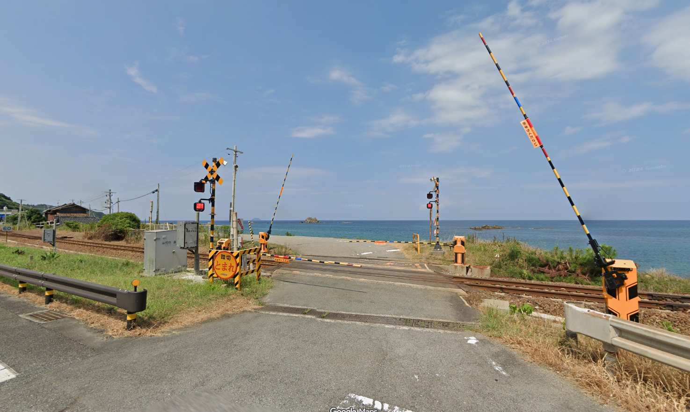

Thankfully I recognised this one quite fast as being the artwork of the song Shoujo Rei by `MORE MORE JUMP！`, from there it only took a google search to find people talking about. A Project Sekai fandom post talks about it being "South of Himada in the Shimane Prefecture", going on google maps and looking around, we can find the exact location to the right of Orii station close to Himada.

<br>

#### Bench - Found


I am no expert on the rivers of Japan, so I opted for pointing out the general location via reverse image search, doing so pointed me to the Uji River in Kyoto. The challenge from then was finding where exactly along the Uji River this was, as it spans acrooss half the length of Kyoto and then some, however I decided to check along the riverbank incrementally. What helped was a couple of things we can see in the original image, the railings, the mountains in the back and nearby bridges, due to the mountains specifically I took the initiative to start further to the right, as it was unlikely for them to be visible so upclose in an urban area. Sure enough with some patience, I found it right next to the Kumiko bridge, which if I had checked for landmarks related to anime first I probably wouldve found it much faster, lol.

<br>

#### Punchdrunk - Not found

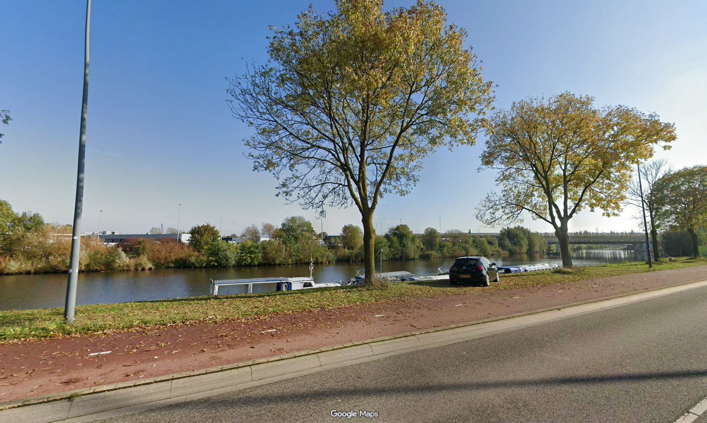

Unfortunately we were stumped on this one for a little while, suspecting Netherlands or the UK (due to the license plate visible), however we were not able to pinpoint any specific location, especially considering the Netherlands' numerous rivers and lakes and whatnot.

<br>

#### Cafe - Not found


I originally thought this one was going to be easy, which was due to the first thing I spotted in the image where we can see a banner on the left that says 'Caltrans'. Searching for this term I learnt that it is the California Department of Transportation, which narrowed down the region in which the location is, however after looking around and attempting a couple of reverse image searches, we never found it and decided to cut our losses due to our lack of time.

<br>

#### Roe - Found

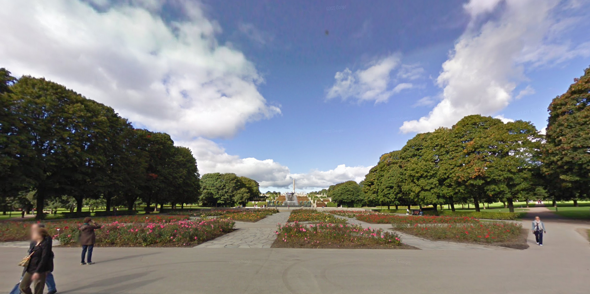

Personally there was not much to absorb from the photo at first glance, obviously a monumental piece within a park but aside from that there is not a lot of information we can grasp, so I reverse image searched the surrounding area. Results were mixed between a park in Norway and a Memorial Cemetery in Leningrad, I was skeptical with it being the latter however after looking at both further, it was clear the location was in Oslo Norway at the Frogner Park, in front of the monolith central to the park area.

<br>

#### Technology & Pumpitup were briefly attempted but not solved due to lack of time
</details>

<br>

***

## osu/ `(4/5 solved)`

<details><summary>

### osu/welcome | `496 solves / 104 points`
</summary>

This flag was found in the osu!gaming CTF 2025 discord server, in the announcements specifically when the event begun. The link to the announcement (if you are in the discord server) is [here](https://discord.com/channels/1203588695886921728/1203590479891931166/1431462468953309235) and the flag is `osu{Rhythm+G4m3_4_L1f3!}`.

SOMEHOW 152 more people solved the crypto/rot727 challenge than this, the easiest possible points you could obtain??
</details>

<details><summary>

### osu/lobby | `261 solves / 109 points`
</summary>

For this challenge, we were told to join the official CTF lobby (osu!gaming CTF 2025) in osu! to claim this flag.

When you joined the lobby, there was a bot waiting that would tell you a command that you had to run in the lobby and after that you got a DM on osu! from sahuang that told you the flag, `osu{Rhythm+G4m3_4_L1f3!}`
</details>

<details><summary>

### osu/files | `166 solves / 116 points`
</summary>

We are given someone's osu!lazer files and we are told that their filesystem got corrupted somehow... so we have to find the file that isn't supposed to be there with the name being the flag once wrapped in osu{}

```py
import os
import hashlib

directory = "" # insert path to files directory
for (dir_path, dir_names, file_names) in os.walk(directory):
    for file_name in file_names:
        sha256 = hashlib.sha256()
        with open(dir_path + "/" + file_name, "rb") as f:
            while True:
                data = f.read(65536)
                if not data:
                    break
                sha256.update(data)

        if file_name != sha256.hexdigest():
            print(file_name)
```

I created this simple program that would loop through every file and compute the SHA256 hash and print out any file names that were not the same as the computed hash. Running this I got 2 results: `35a277c4a9569b7aab42998b00315f0ce849c463269c992c42ac5086cc630c42` and `80e4c02268d49ca010e3c62fcc2615da2fad4cf0c359eb8fedc0366739b34205` but I don't remember which one solved the challenge.
</details>

<details><summary>

### osu/survey | `139 solves / 120 points`
</summary>

The final challenge! Complete a survey and at the end we were told the flag: `osu{see_you_next_time}`

</details>

<br>

***

## ppc/ `(0/1 solved)`

<br>

***

## pwn/ `(0/3 solved)`

<br>

***

## rev/ `(0/3 solved)`

<br>

***

## rhythm/ `(1/5 solved)`

<details><summary>

### rhythm/ksh | `65 solves / 147 points`
</summary>

In this challenge we were given a .ksh file and told that the latest version of this map was better.

After some digging I discovered that this file was for the game K-Shoot MANIA and then found a [website](https://ksm.dev/) that custom KSM charts could be uploaded to. Here I searched `effector:Quintec` and found a single upload from him named [Harumachi Clover](https://ksm.dev/songs/6e1f4180-a7c0-11f0-a7a9-0b179b1c9a1b/) with the description being `osu{f4iry_d4nc1ng_`

Then I downloaded the song and inspected the .ksh file to find the illustrator property as `in_l4k3_eeeeee}`

Combining the description and the illustrator, the flag came out to be `osu{f4iry_d4nc1ng_in_l4k3_eeeeee}` and successfully solved the challenge.

</details>

<br>

***

## web/ `(2/7 solved)`

<details><summary>

### web/osu-css | `87 solves / 134 points`
</summary>

For this challenge we have osu! but.. it is in the web browser.... AND ONLY USES HTML+CSS??? To be specific, it is a specific beatmap, The Big Black that we have to play and achieve an S rank on to obtain the flag.

My first approach was to use the same program (slightly modified though) I used in web/human-benchmark for the aim trainer test but this had some success, achieving a rank B but that was not enough.

Next, I looked at the source code and retrieved the letters that composed the flag but their height was determined by some really long math that I did not want to figure out. It was also not possible to brute force this since 39 possible combinations for each of the 43 letters!

In the end, I just started tearing apart the website and hoping I would stumble upon the answer.  
Firstly, I let the song play normally.  
After that, I wrote some small code that I pasted in the console that made EVERYTHING visible (by setting the transform scale to 1).  
This revealed every circle, letter and rank and from here I just had to click circles until I eventually obtained S rank and the flag `osu{1m_n0t_4fr4id_0f_the_b1g_bl4ck_4nym0r3}`

<video controls src="https://i.buggirls.xyz/osu_gaming_CTF_2025_osu_css-xPkRvIJwKkWH.mp4"></video>
</details>

<details><summary>

### web/human-benchmark | `56 solves / 155 points`
</summary>

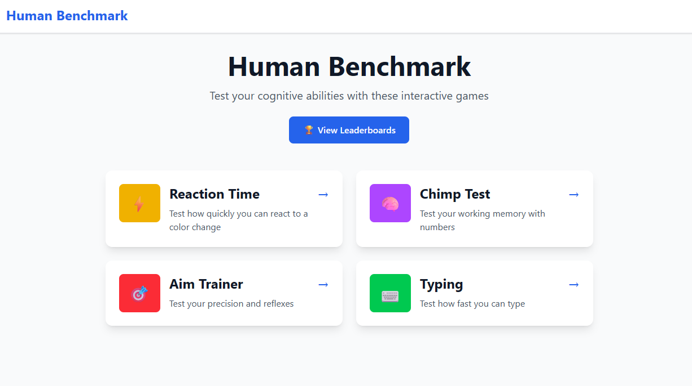

In this challenge we are asked the question of whether we can get to the top of a human benchmark website with 4 categories: Reaction Time, Chimp Test, Aim Trainer and Typing.

Upon first inspection of the website, we can see that the first place on reaction time is 30ms, on chimp test it is level 64 with a time of 200s, on aim trainer it is 400 hits and on typing it is 1000WPM. This meant that there was no chance I could achieve these scores myself and would have to use tools.

<br>

#### Reaction Time

This test tests the reaction time of a person by having a red box turn green after some time and seeing how long it takes the user to click once this happens.  
My first idea to solve this was to have a program to detect color at a certain pixel and then click as soon as it became green. 

```py
import cv2
import numpy as np

import mss
import win32api
import win32con

with mss.mss() as sct:
    monitor = {"top": 727, "left": 727, "width": 1, "height": 1}

    while True:
        img = np.array(sct.grab(monitor))

        if np.array_equal(img[0][0], [80, 201, 0, 255]):
            win32api.mouse_event(win32con.MOUSEEVENTF_LEFTDOWN,727,727,0,0)
            win32api.mouse_event(win32con.MOUSEEVENTF_LEFTUP,727,727,0,0)
```

The program worked but it could not obtain a very quick reaction test result. It kept getting around ~200ms despite using libraries that would induce no delay. After that failure I inspected the website for anything I could exploit and stumbled upon the network tab which showed a websocket being used to send messages as JSONs/dictionaries. The transaction looked like this:
```json
// CLIENT: The user clicked to begin test
{
    "type": "ready"
}

// SERVER: (After some time) Time to click!
{
    "type": "go"
}

// CLIENT: Receieved time to click
{
    "type": "goReceived",
    "timestamp": 0 // time received go goes here
}

// CLIENT: User clicked
{
    "type": "click",
    "timestamp": 0 // time clicked goes here
}

// SERVER: Results
{
    "type": "score",
    "score": 0, // reaction time result given here
    "success": true // ??
}
```

Using this new knowledge I crafted a new python script given below that abused the websocket, allowing me to get a reaction time of 0ms (woah, faster than speed of light)!!

```py
import time
import asyncio
import websockets

URL = "" # copy paste the websocket URL from network tab in browser
async def chat():
    async with websockets.connect(URL) as websocket:
        while True:
            await websocket.send('{"type":"ready"}')
            
            response = await websocket.recv()
            
            timeNow = str(int(time.time() * 1000))
            await websocket.send('{"type":"goReceived","timestamp":'+timeNow+'}')
            await websocket.send('{"type":"click","timestamp":'+timeNow+'}')

            response = await websocket.recv()
            print(response)
            break

if __name__ == "__main__":
    asyncio.run(chat())
```

<br>

#### Chimp Test

In this test we have an 8x8 grid of squares with numbers at random locations that we have to click in order. We have an infinite amount of time to memorise the square locations but once we click a square, the numbers disappears.  
Using websockets again, the transaction looked like this:    
```json
// CLIENT: The user initated the test
{
    "type": "start"
}

// SERVER: Sends back level data
{
    "type": "levelData",
    "level": 1, // level you are on given here
    "positions": [
        {
            "number": 1, 
            "row": 7, // row #1 is on given here
            "col": 2 // column #1 is on given here
        }
    ]
}

// CLIENT: User clicks squares
{
    "type": "click",
    "number": 1, // square number goes here
    "row": 7, // row clicked goes here
    "col": 2, // column clicked goes here
    "timestamp": 7 // time clicked goes here
}

// SERVER: User successfully completed level by clicking every square
// after this, repeat from server sending levelData
{
    "type": "levelComplete",
    "level" 1 // level completed given here
}
// SERVER: ORRR User failed level if row & col sent didn't match number
{
    "type": "gameOver",
    "level": 1 // level failed given here
}

// SERVER: Results sent once game failed OR level 64 completed
{
    "type": "score",
    "score": 1, // level reached given here
    "time" : 7, // time taken given here
    "success": true, // ??
    "perfect": true // only sent if completed all 64 levels?
}
```

Using this, I again wrote a python script that was really similar to the reaction time test and finished level 64 in just ~4.5 seconds.

```py
import time
import asyncio
import websockets
import ast

URL = "" # copy paste the websocket URL from network tab in browser

async def chat():
    async with websockets.connect(URL) as websocket:
        await websocket.send('{"type":"start"}')
        
        while True:
            response = await websocket.recv()
            response = ast.literal_eval(response)

            for pos in list(response["positions"]):
                newPos = {"type":"click"}
                for i,v in pos.items(): newPos[i] = v 
                newPos["timestamp"] = int(time.time() * 1000)
                await websocket.send(str(newPos).replace("'", '"'))

            if response["level"] == 64:
                break

if __name__ == "__main__":
    asyncio.run(chat())
```

<br>

#### Aim Trainer

For this test, we have a screen that blue circles appear on that we have to click where the order doesn't matter, we just have to do this before the circle shrinks fully.  
For this one, I did not use websockets but instead processed my display in real time to find blue pixels that the mouse then moves to (with an offset to account for shrinking over time) and clicks.

```py
import mss
import numpy as np
import win32api
import win32con

monitor = {"top": 320, "left": 320, "width": 570, "height": 440}

with mss.mss() as sct:
    while True:
        img = np.array(sct.grab(monitor))
        click = np.argwhere(np.all(img == [235, 99, 37, 255], axis=-1))

        if click.size > 0:
            pos = (click[0][1]+320, click[0][0]+320+16)
            win32api.SetCursorPos(pos)
            win32api.mouse_event(win32con.MOUSEEVENTF_LEFTDOWN,pos[0],pos[1],0,0)
            win32api.mouse_event(win32con.MOUSEEVENTF_LEFTUP,pos[0],pos[1],0,0)
```

<video controls src="https://i.buggirls.xyz/osu_gaming_CTF_2025_Human_Benchmark_Aim_Trainer-G5Ho6yNzeP2P.mp4"></video>

Now this one was my favourite test because well, the video speaks for itself.

<br>

#### Typing

For the final test, we have to type 25 words as quickly as possible.  
My first idea was again to not use websockets but instead have a mini python program that I could input the words into (since test did not begin until first word typed) and it would type it really quickly.

```py
import time, keyboard

text = input("enter text:")
time.sleep(5)
keyboard.write(text)
```

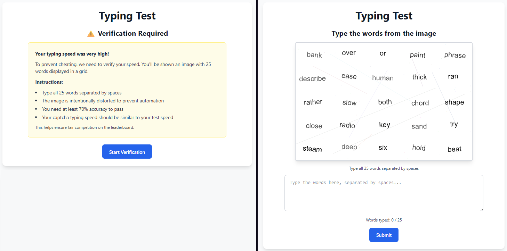

Using this program I did indeed get a very high score BUT this was not the end. THERE WAS A CAPTCHA! (as seen above, the image with 5x5 grid of words) Since I was using the website, the captcha test begun as soon as it was shown resulting in me having no time to enter the words into my program and then also click the submit button in less than 1/1000th of a second.  
As a result, I had to resort back to using websockets again since I did not want to deal with an OCR (Optical Character Recognition). The transaction of the websocket looked like this:  
```json
// SERVER: Send word list to type
{
    "type": "session",
    "words": [] // 25 words (as string) given here
}

// CLIENT
{
    "type": "start"
}

// CLIENT: User finished typing a word (pressed space bar)
// Repeat for all 25 words
{
    "type": "word",
    "word": "", // user input goes here
    "wordIndex": 0, // position of word goes here
    "timestamp": 0 // time typed at goes here
}

// CLIENT: Last word typed, test finished
{
    "type": "end"
}

// SERVER: Captcha information sent
{
    "type": "captcha",
    "image": "data:image/svg+xml;base64,", // image data given after ,
    "expectedWpm": 0 // wpm expected for captcha given here
}

// CLIENT: User ready to type captcha
{
    "type": "captchaStart"
}

// SERVER: Server ready to receive captcha
{
    "type": "captchaReady"
}

// CLIENT: User submit words typed
{
    "type": "captcha",
    "text": "" // words typed goes here
}

// SERVER: Results
{
    "type": "score",
    "score": 0, // raw wpmx multiplied by accuracy given here
    "rawWpm": 0, // words finished per minute given here
    "accuracy": 0, // how accurately you typed words given here
    "success": true // ??
}
```

I made a new program that would automatically type the first part's 25 words and then stores the svg image given by captcha that we have to manually look at and input the words on it into the program to be then sent to the server and complete the final test.

```py
import time
import asyncio
import websockets
import ast
import base64

URL = "" # copy paste the websocket URL from network tab in browser

async def chat():
    async with websockets.connect(URL) as websocket:
        response = await websocket.recv()

        await websocket.send('{"type":"start"}')

        response = ast.literal_eval(response)
        for i, word in enumerate(response["words"]):
            data = str({"type":"word","word":word,"wordIndex":i,"timestamp":int(time.time() * 1000)}).replace("'", '"')
            await websocket.send(data)
        
        await websocket.send('{"type":"end"}')
        
        response = await websocket.recv()
        response = ast.literal_eval(response)
        with open("image.svg", "wb") as f:
            f.write(base64.b64decode(response["image"].split(",")[1]))
        data = input("Read me the svg: ")

        await websocket.send('{"type":"captchaStart"}')
        
        response = await websocket.recv()

        await asyncio.sleep(1500/response["expectedWpm"])
        await websocket.send('{"type":"captcha","text":"'+data+'"}')
        
        response = await websocket.recv()

if __name__ == "__main__":
    asyncio.run(chat())
```

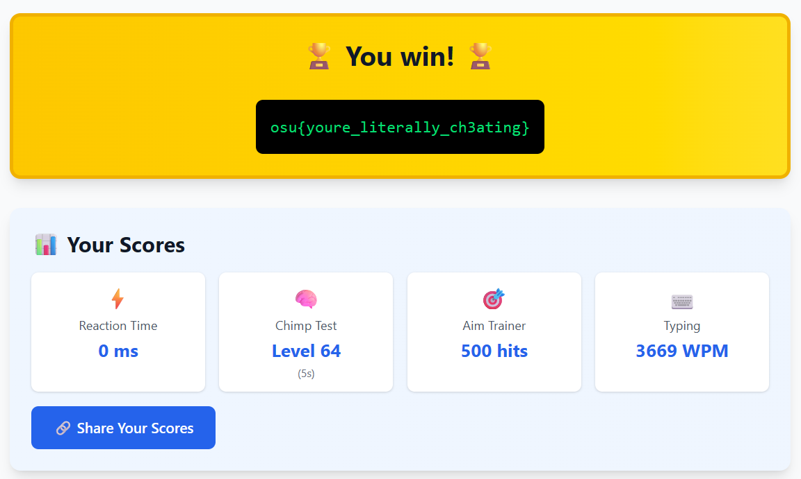

The flag after finishing all 4 tests in first place was given, `osu{youre_literally_ch3ating}`  
Can you beat my scores? :3

</details>

<details><summary>

### ~~*web/blue-zenith*~~ | `65 solves / 147 points`
</summary>

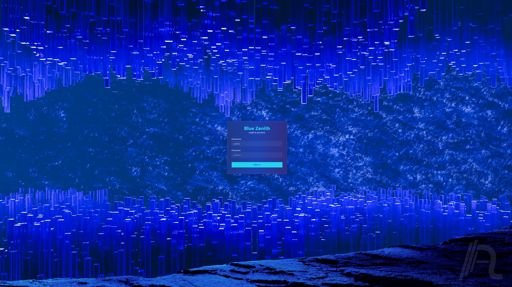

We are given a login website with a username and password field.

Firstly, I tried to inspect element the website and quickly found a [YouTube video](https://www.youtube.com/watch?v=HXNjOskFZ3k/) that said "nice score". However, after reading the description, comments and checking the channel, I came to the conclusion that this was a distraction and likely unrelated to the challenge.

Afterwards, I thought this could be SQL injection perhaps and when I inputted an apostrophe (`'` < I think that is what it's called) I got a 500, "Internal Server Error". Then when I put a -- (a comment) after the apostrophe, the error was gone and just returned invalid creditentials error. So, I then tried simple SQL injections I knew such as `' OR 1=1 --` but none of these works and after some time I gave up on this challenge.
</details>

<br>

***

*see you next time! :)  
\- osu! person*